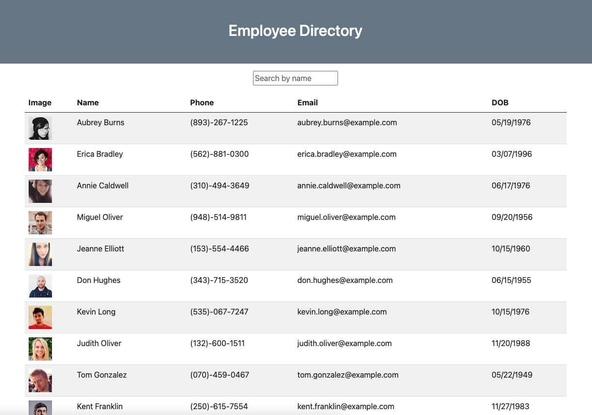

# Employee-Directory
## Table of Contents

1. [Description](#description)
2. [Installation](#installation-instructions)
3. [Contributing](#contributers)
4. [License](#license)

### Description
Utilizing React components and states, my application generates 25 users (using the Random User API) to create an employee directory. The directory can be sorted alphabetically by clicking 'Name' in the table header, and the search bar allows you to search for a specific user within the directory.

### Installation Instructions
To install from GitHub, follow these steps:
1. Pull the repository.
2. Within the terminal, npm install.
3. Start the application via npm start.

**Preview of App**

[Link to Application](https://github.com/rachelamos/employee-directory.git)

### Deployment to GitHub Pages
[Link to GitHub Page](https://rachelamos.github.io/employee-directory/)

### Questions
If you have any other questions, you can reach me:
- via email: rachelamos35@gmail.com
- via GitHub: https://github.com/rachelamos

### License
This project is covered under the [MIT](LICENSE) license.

### Contributers
© Rachel Amos